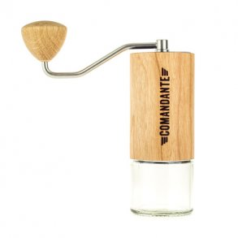

## Kalita Kaffekværn KH-3
### Kalita
### 04-1210

### Kompakt håndkværn i retrodesign fra Kalita

* Kalita Kaffekværn KH-3
* 445,00 DKK (inkl. moms)
* Kalita

Kompakt kaffekværn fra japanske Kalita. Der er ikke noget bedre end friskkværnet kaffe, og med denne håndkværn er der ingen undskyldning for ikke at bruge friskkværnet kaffe til din sorte håndbryggede kaffe. 
Kroppen er udført i smukt træ, du kan indstille kværnen til at ramme den formalingsgrad, du skal bruge. Du kan cirka fylde 35 gram kaffe i øverste beholder, og fylder du op undervejs, er der plads til cirka 55 gram i beholderen, du kværner ned i.
###########################################################################

## Hario Skerton Kaffekværn MSCS-2TB
### Hario
### 05-0901

### Lækker håndkværn med keramiske kværnblade.

***************************************************************************
* Hario Skerton Kaffekværn MSCS-2TB
* 238,95 DKK 
* 365,00 DKK (inkl. moms)
* Hario

### Håndkværn fra japanske Hario med keramiske kværnblade.
Mal dine bønner i hånden med denne smukke kværn. Du fylder bønnerne i kværnen for oven i kammeret, der er lavet i slagfast, skridsikkert plast, der sørger for, at kværnen ikke smutter fra dig. Alle metaldele er produceret i rustfrit stål, og de keramiske kværnblade giver dig en ensartet formalingsgrad, der er helt i top.
Når du kværner kaffe i hånden, udvikler der kaffen ikke lige så meget varme som ved en elektronisk kværn. Aromastofferne bliver derfor bedre bevaret, og eftersom det er dine egne kræfter du skal bruge, kværnes der sjældent for meget. Skulle det ske, eller vil du gerne have kværnet kaffen på forhånd, kan du erstatte kværndelen med det medfølgende tætsluttende låg. Der er plads til 100 g kaffe i kværnen.
###########################################################################

## Hario Slim Kaffekværn MSS-1B
### Hario
### 05-0902

### Lille håndkværn fra Hario, der er perfekt, hvis du skal have kaffe på farten.

***************************************************************************
* Hario Slim Kaffekværn MSS-1B
* Produktet er udsolgt.
* 295,00 DKK (inkl. moms)
* Hario

Lille håndkværn fra japanske Hario, der med sine keramiske, koniske kværnknive leverer en uovertruffen formalingsgrad. På Hario Slim kan du kværne ca. 24 g kaffe af gangen, og den kompakte størrelse sikrer dig masser af plads i kufferten. Vi har flere kunder, der bruger den på forretningsrejse, for at være sikre på, at de kan få en ordentlig kop kaffe, når de overnatter på hotel. Hario Slimm er også perfekt til turen i ødemarken og de 24 gram kaffe, kan du enten bruge i en lille stempelkande, i din Aeropress eller til V60 kaffe
Hario har lavet en lille demonstration af kværnen, som du kan se nedenfor.
 ###########################################################################
Comandante C40 Nitro Blade Håndkværn - American Cherry
Comandante
05-1104

Håndkværn med koniske stålknive - pakket ind i amerikansk kirsebærtræ

***************************************************************************
Comandante C40 Nitro Blade Håndkværn - American Cherry
1.795,00 DKK
(inkl. moms)
 Comandante

Denne tyske Comandante C40 Nitro Blade American Cherry håndkværn, er udført i den højeste kvalitet, og det samme er de koniske kværnknive, der sørger for at kværne din kaffe. 
Selve kværnkammeret er i rustfrit stål, og pakket ind i lækker finish af amerikansk kirsebærtræ . Kværnbladene er udført i en speciel ståltype, der er utrolig holdbart, og de giver en utrolig ensartet partikeldistribution, du kan kværne til alt fra espresso til stempel.
Comandante vejer kun 630 gram og er perfekt til at tage med på farten. Den er eksempelvis en genial rejsemakker til din Aeropress eller Cafflano. 
Den kværnede kaffe lander i en lille glasbeholder under selve kværnen, som du let kan skrue af, og fordele i din kaffebrygger. Der kan ca være 40 gram i beholderen. Takket være designet på svingarmen, er det relativt let at arbejde med håndkværnen. Skal du kværne kaffe til en dobbelt espresso, tager det ca. 40 sekunder. Kværner du 12 gram til en Hario, vil det ca tage 25 sekunder.
###########################################################################
Hario Slim Kaffekværn Pro Sort MMSP-1-B
Hario
05-0904

Hario Mini-Slim Pro er en forbedret udgave af den lille Slim håndkværn fra japanske Hario, denne udgave er i flot sort finish.

***************************************************************************
Hario Slim Kaffekværn Pro Sort MMSP-1-B
395,00 DKK
(inkl. moms)
 Hario
Hario Mini-Slim Pro er en forbedret udgave af den lille Slim håndkværn fra japanske Hario, med opgraderiede sine keramiske, koniske kværnknive, som leverer en uovertruffen formalingsgrad for den bedste kop kaffe, filter eller espresso, hvor end du befinder dig.. På Hario Slim kan du kværne ca. 24 g kaffe af gangen, og den kompakte størrelse sikrer dig masser af plads i kufferten. Vi har flere kunder, der bruger den på forretningsrejse, for at være sikre på, at de kan få en ordentlig kop kaffe, når de overnatter på hotel. Hario Slimm er også perfekt til turen i ødemarken og de 24 gram kaffe, kan du enten bruge i en lille stempelkande, i din Aeropress eller til V60 kaffe
###########################################################################
Comandante C40 Nitro Blade Håndkværn - Zebra
Comandante
05-1105
Håndkværn med koniske stålknive - pakket ind i zebratræ

***************************************************************************

Comandante C40 Nitro Blade Håndkværn - Zebra
1.795,00 DKK
(inkl. moms)
 Comandante

Denne tyske Comandante C40 Nitro Blade Zebra håndkværn, er udført i den højeste kvalitet, og det samme er de koniske kværnknive, der sørger for at kværne din kaffe. 
Selve kværnkammeret er i rustfrit stål, og pakket ind i lækker finish af zebra-stribet træ . Kværnbladene er udført i en speciel ståltype, der er utrolig holdbart, og de giver en utrolig ensartet partikeldistribution, du kan kværne til alt fra espresso til stempel.
Comandante vejer kun 630 gram og er perfekt til at tage med på farten. Den er eksempelvis en genial rejsemakker til din Aeropress eller Cafflano. 
Den kværnede kaffe lander i en lille glasbeholder under selve kværnen, som du let kan skrue af, og fordele i din kaffebrygger. Der kan ca være 40 gram i beholderen. Takket være designet på svingarmen, er det relativt let at arbejde med håndkværnen. Skal du kværne kaffe til en dobbelt espresso, tager det ca. 40 sekunder. Kværner du 12 gram til en Hario, vil det ca tage 25 sekunder.
